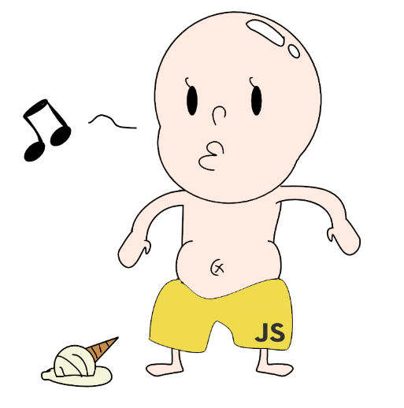

# i dont wanna go to korea army

* ㅅㅂ 내가 어드민인데 왜 commit가 안돼지
* 개인 저장소에 fork 떠서 -> full request 보내긴 귀찮은데
* 아 이거 방법이 있을거 같은데
* http://jinyongjeong.github.io/2019/10/27/github_403error/
* 이게 왜 이러냐면 -> org를 만든 순간 github id가 바뀐 판정인데 내 컴퓨터 global github 사용자는 homeless-org가 아니라 homeless-leesky인듯
* 근데 ㅅㅂ 위에 링크 따라 할라고 했는데 수정이 불가능하네;
